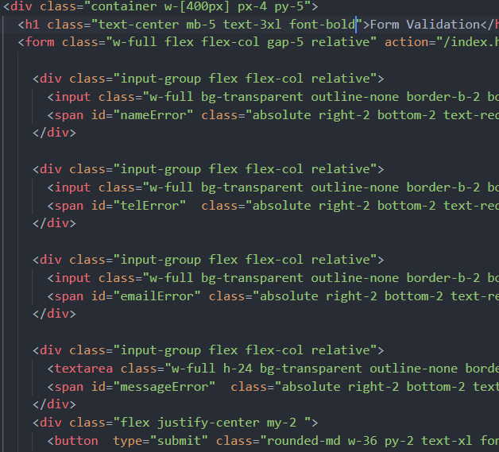
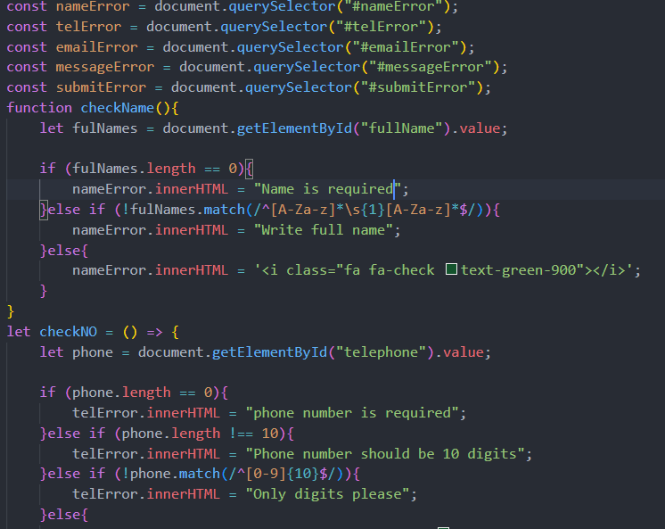
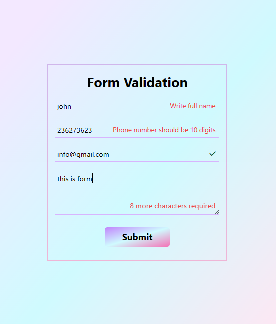

# Form Validation Project 
Hello, this project is very simple, everyone can understand it.

## What we use in this project

    -Hypertext Markup Language (html)
    -Tailwind css 
    -Javascript (js)

## Some pictures of our project 

 *Picture1: useful html and tailwind css

To show our code using Tailwind css you can use class attribute. example.

`
 lorem... 
"`

 *Picture2: useful Javascript

  -Running the code we get the following output

 *Picture3: useful output

 ### If you want to help me

Please follow me on github that helps

